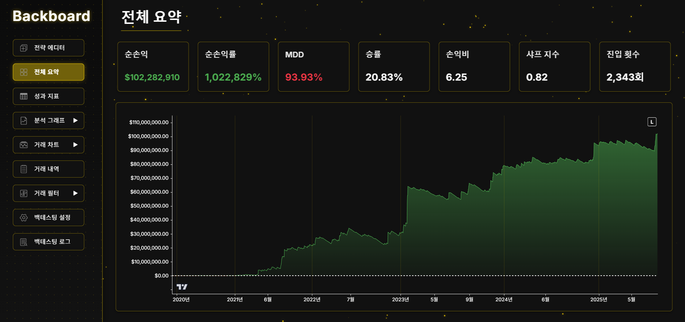
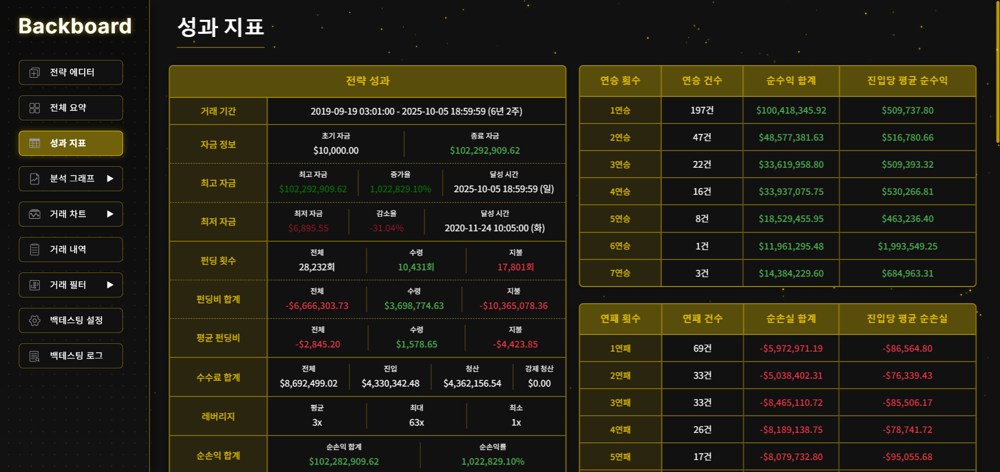
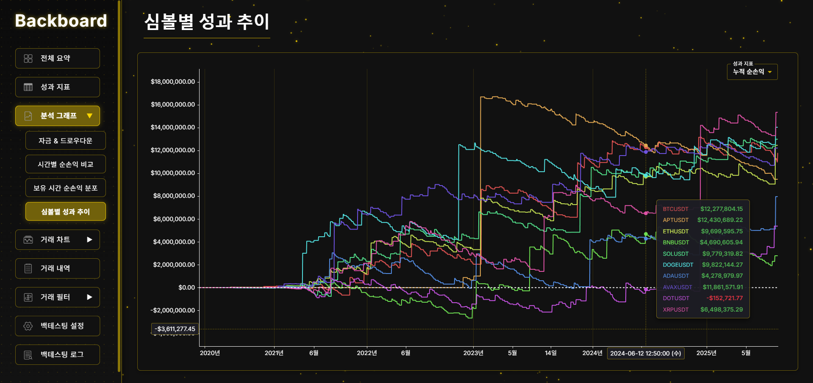
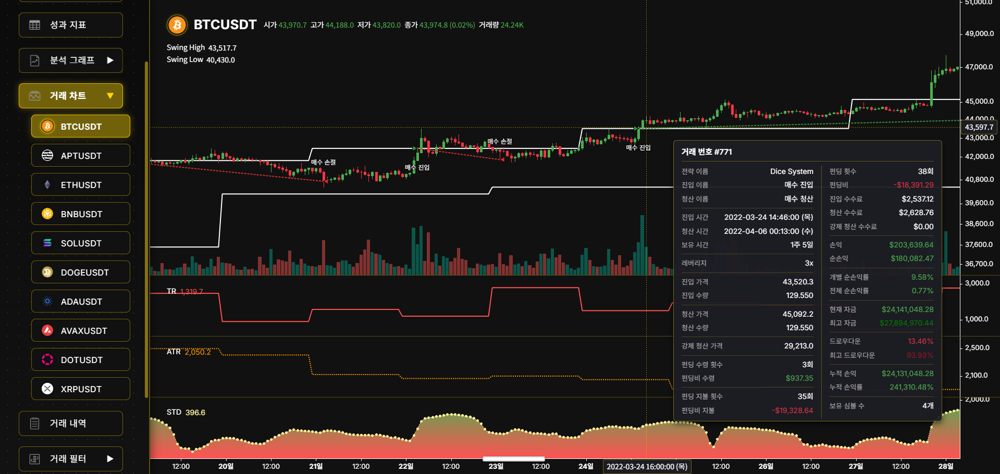
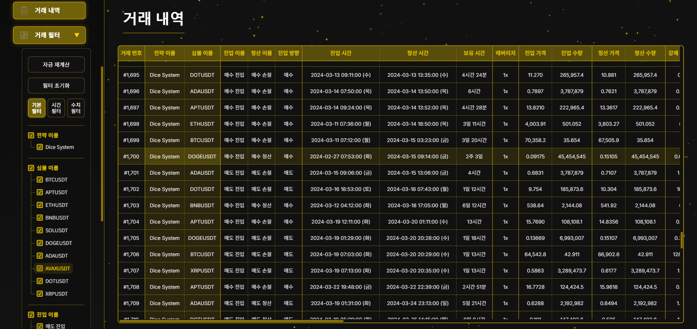
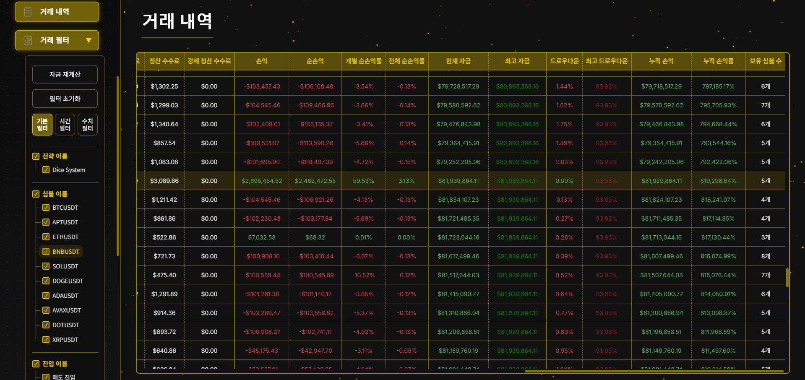
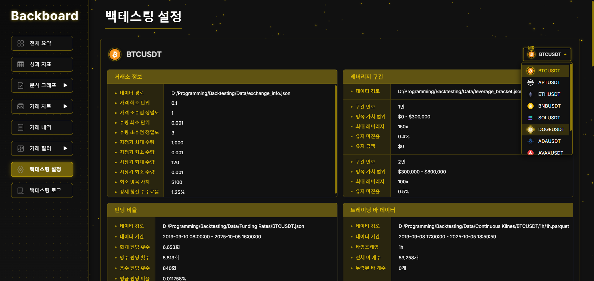
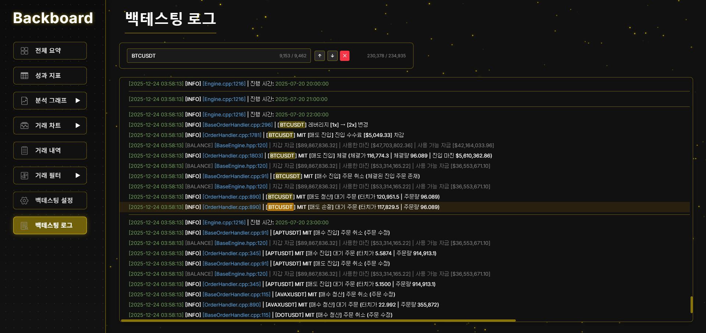

# Backtesting

A high-performance multi-symbol backtesting engine meticulously architected to mirror the **Binance Futures** trading environment.
It combines a C++20 core built for speed and determinism with a React/TypeScript dashboard (BackBoard) that provides comprehensive visualization of simulation results.

---

## Overview

This system is designed to simulate the intricacies of the Binance Futures ecosystem with high fidelity. It operates on a streamlined workflow:

1. **Market Data Ingestion**: High-efficiency Parquet time series (OHLCV, Mark Price) located in `Data/`.
2. **Core Simulation**: A C++ engine executing vectorized bar processing with precise handling of isolated margin, funding rates, and fee structures specific to Binance.
3. **Result Generation**: Comprehensive output generation in timestamped directories under `Results/`.
4. **Visualization**: Interactive analysis via BackBoard, reading directly from `Results/<run>/BackBoard/*`.

The engine supports **multi-symbol portfolio backtesting in a single execution**, maintaining explicit control over execution logic including bar assumptions, magnifier bar granularity, and isolated margin mechanics.

---

## Performance

One real-world benchmark (user-measured):

- **Universe:** 10 symbols
- **Period:** ~7 years
- **Trading bars:** 1h
- **Magnifier bars:** 1m
- **Runtime:** ~10 seconds (typical)

Approximate scale (order-of-magnitude; depends on date range and missing bars):

- Trading bars per
  symbol: $7\nobreakspace\text{years} \times 365\nobreakspace\text{days} \times 24\nobreakspace\text{hours} \approx 61\nobreakspace\text{k bars}$
- Magnifier bars per symbol: $61\nobreakspace\text{k} \times 60 \approx 3.7\nobreakspace\text{M bars}$
- Total magnifier bars (10 symbols): $\approx 37\nobreakspace\text{M bars}$

---

## Gallery

[](Docs/Images/overview.png)
*Figure: Run overview — equity curve and key metrics.*
<br><br>

[](Docs/Images/performance.png)
*Figure: Performance summary.*
<br><br>

[](Docs/Images/symbol_performance.png)
*Figure: Per-symbol performance.*
<br><br>

[](Docs/Images/chart.png)
*Figure: Symbol chart with indicators and executed trades.*
<br><br>

[](Docs/Images/trade_list1.png) [](Docs/Images/trade_list2.png)
*Figure: Trade list (paged view).*
<br><br>

[](Docs/Images/config.png) [](Docs/Images/log.png)
*Figure: Run manifest and runtime log snippet.*
<br><br>

---

## Quick Example

This is a minimal, end-to-end sketch of how a local backtest is typically configured using the public API.

```cpp
#include "Engines/Backtesting.hpp"

#include <string>
#include <vector>

using namespace std;
using namespace backtesting::main;

int main() {
  const vector<string> symbols = {"BTCUSDT", "ETHUSDT", "SOLUSDT"};

  Backtesting::SetMarketDataDirectory("D:/Dev/Backtesting/Data");

  // Core engine settings (project directory is used for outputs and source auto-detection)
  Backtesting::SetConfig()
      .SetProjectDirectory("D:/Dev/Backtesting")
      .SetBacktestPeriod()  // empty = full available range
      .SetUseBarMagnifier(true);

  // Bar streams
  Backtesting::AddBarData(symbols, "1h", "D:/Dev/Backtesting/Data/Continuous Klines", TRADING);
  Backtesting::AddBarData(symbols, "1m", "D:/Dev/Backtesting/Data/Continuous Klines", MAGNIFIER);
  Backtesting::AddBarData(symbols, "1m", "D:/Dev/Backtesting/Data/Mark Price Klines", MARK_PRICE);

  // Exchange metadata (optional but recommended)
  Backtesting::AddExchangeInfo("D:/Dev/Backtesting/Data/exchange_info.json");
  Backtesting::AddLeverageBracket("D:/Dev/Backtesting/Data/leverage_bracket.json");
  Backtesting::AddFundingRates(symbols, "D:/Dev/Backtesting/Data/Funding Rates");

  // Strategy (one per run)
  // Backtesting::AddStrategy<MyStrategy>("My Strategy");

  Backtesting::RunBacktesting();
  return 0;
}
```

After a run completes, open the newest folder under `Results/` and point BackBoard to `Results/<run>/BackBoard/`.

---

## Repository Layout

- **C++ Engine (headers):** `Includes/Engines/`, `Includes/Indicators/`, `Includes/Strategies/`
- **C++ Engine (implementation):** `Sources/cpp/Engines/`, `Sources/cpp/Indicators/`, `Sources/cpp/Strategies/`
- **BackBoard (Node + React):** `Sources/js/`
    - Entry shim: `Sources/js/launch.js`
    - Server: `Sources/js/server/launch.js` (Express + WebSocket)
- **Market data:** `Data/`
    - `Continuous Klines/` (OHLCV Parquet)
    - `Mark Price Klines/` (mark price Parquet)
    - `Funding Rates/` (JSON)
    - `exchange_info.json`, `leverage_bracket.json`
- **Backtest outputs:** `Results/<YYYYMMDD_HHMMSS>/`

---

## Engine Model (What is Simulated)

- **Bar-driven execution**
    - Core processing is based on OHLC traversal; the exact intrabar ordering is controlled by the engine’s internal
      price-queue assumptions.
- **Magnifier bars (optional)**
    - When enabled, the engine refines execution inside a trading bar using a smaller timeframe bar stream.
- **Mark price integration**
    - Unrealized PnL and liquidation checks use mark price when available; when mark price data is missing, the engine
      falls back to market price.
- **Isolated margin entries**
    - Each entry manages its own margin; concurrent entries are restricted to a single direction per symbol (no
      hedge-style long+short concurrency).
- **Single-strategy constraint per run**
    - The engine runs **one** `Strategy` per backtest execution.
    - BackBoard can be used to compare/compose results across multiple independent runs.
- **DLL-based Strategy/Indicator Loading**
  - Strategies and indicators are compiled into separate DLLs and loaded by the backtesting engine at runtime.

---

## Data Contract

### Bar schema

Bars are expected as Parquet with the following logical columns:

- `open_time` (epoch ms)
- `open`
- `high`
- `low`
- `close`
- `volume`
- `close_time` (epoch ms)

### Timeframes

Timeframes follow a compact string convention such as `1m`, `1h`, `1d`.

---

## Output Contract (What BackBoard Reads)

Each run creates a timestamped directory:

```
Results/<YYYYMMDD_HHMMSS>/
  BackBoard/
    config.json
    trade_list.json
    backtesting.log
    Indicators/
      <IndicatorName>/
        <IndicatorName>.parquet
    Sources/
      <StrategyClass>.cpp
      <StrategyClass>.hpp
      <IndicatorClass>.cpp
      <IndicatorClass>.hpp
  ... (BackBoard static assets may also be copied alongside)
```

Notes:

- `BackBoard/config.json` is a comprehensive run manifest (symbols, bar coverage, exchange/leverage/funding metadata,
  engine settings, strategy/indicator descriptors).
- `BackBoard/trade_list.json` is exported as UTF-8 with BOM for compatibility.
- `BackBoard/Indicators/*` stores indicator time series for plotted (non-OHLCV) indicators.
- `BackBoard/Sources/*` stores copies of the strategy/indicator source/header files when paths are available.
- If a local BackBoard package is present at `Sources/js/BackBoard Package`, it is copied into the run directory;
  otherwise, the engine can fetch a packaged BackBoard from a GitHub release as a fallback.

---

## Extending the System

### SMA (Indicator)

The repository already includes a built-in Simple Moving Average indicator:

- Class: `SimpleMovingAverage`
- Header: `Includes/Indicators/SimpleMovingAverage.hpp`

SMA is typically instantiated inside a strategy constructor via `AddIndicator<T>(...)` and stored as a reference:

```cpp
// Example snippet inside a Strategy constructor
SimpleMovingAverage& sma = AddIndicator<SimpleMovingAverage>(
    "sma", trading_timeframe,
    Line(Rgba::orange, 2, SOLID, SIMPLE, false, 0, true), close, 20);
```

SMA indicator code (based on the repository implementation):

```cpp
// Includes/Indicators/SimpleMovingAverage.hpp
#pragma once

#include <vector>

#include "Engines/Indicator.hpp"
#include "Engines/Logger.hpp"

/// Simple Moving Average (SMA)
// Note: If this indicator is built/loaded as a DLL, the build system automatically handles proper linkage
class BACKTESTING_API SimpleMovingAverage final : public Indicator {
 public:
  explicit SimpleMovingAverage(const string& name, const string& timeframe,
                               const Plot& plot, Indicator& source,
                               double period);

 private:
  Indicator& source_;
  double double_period_;
  size_t sizet_period_;

  int count_;
  double sum_;
  bool can_calculate_;

  vector<double> buffer_;
  size_t buffer_idx_;

  void Initialize() override;
  Numeric<double> Calculate() override;
};
```

```cpp
// Sources/cpp/Indicators/SimpleMovingAverage.cpp
#include "Indicators/SimpleMovingAverage.hpp"
#include <algorithm>

SimpleMovingAverage::SimpleMovingAverage(const string& name,
                                         const string& timeframe,
                                         const Plot& plot, Indicator& source,
                                         const double period)
    : Indicator(name, timeframe, plot),
      source_(source),
      double_period_(period),
      sizet_period_(static_cast<size_t>(period)),
      count_(0),
      sum_(0.0),
      can_calculate_(false),
      buffer_(static_cast<size_t>(period), 0.0),
      buffer_idx_(0) {
  if (period <= 0) {
    Logger::LogAndThrowError(
        format("SimpleMovingAverage period [{}] must be > 0", period),
        __FILE__, __LINE__);
  }
}

void SimpleMovingAverage::Initialize() {
  count_ = 0;
  sum_ = 0.0;
  can_calculate_ = false;
  ranges::fill(buffer_, 0.0);
  buffer_idx_ = 0;
}

Numeric<double> SimpleMovingAverage::Calculate() {
  const double value = source_[0];

  const double old = buffer_[buffer_idx_];
  buffer_[buffer_idx_] = value;
  buffer_idx_ = (buffer_idx_ + 1) % sizet_period_;

  sum_ += value;

  if (!can_calculate_) {
    if (count_++ < static_cast<int>(sizet_period_) - 1) {
      return NAN;
    }
    can_calculate_ = true;
  } else {
    sum_ -= old;
  }

  return sum_ / double_period_;
}
```

Notes:

- OHLCV references (`open`, `high`, `low`, `close`, `volume`) are provided by default.
- Only non-OHLCV indicators with an active plot configuration are eligible for persistence under
  `Results/<run>/BackBoard/Indicators/`.

### Simple SMA Strategy Example

This minimal example follows the same pattern used in the codebase (see `TestStrategy`):

- Adds one `SimpleMovingAverage` indicator
- Enters on price crossing SMA

Source path auto-detection (used for saving sources into `Results/<run>/BackBoard/Sources/`) expects:

- `Includes/Strategies/<ClassName>.hpp`
- `Sources/cpp/Strategies/<ClassName>.cpp`

```cpp
// Includes/Strategies/SmaStrategy.hpp
#pragma once

#include "Engines/Strategy.hpp"

class BACKTESTING_API SmaStrategy final : public Strategy {
 public:
  explicit SmaStrategy(const string& name);
  ~SmaStrategy() override;

  void Initialize() override;
  void ExecuteOnClose() override;
  void ExecuteAfterEntry() override;
  void ExecuteAfterExit() override;

 private:
  SimpleMovingAverage& sma_;
};
```

```cpp
// Sources/cpp/Strategies/SmaStrategy.cpp
#include "Strategies/SmaStrategy.hpp"

SmaStrategy::SmaStrategy(const string& name)
    : Strategy(name),
      sma_(AddIndicator<SimpleMovingAverage>(
          "sma", "1h", Line(Rgba::orange, 2, SOLID, SIMPLE, false, 0, true),
          close, 20)) {}

SmaStrategy::~SmaStrategy() = default;

void SmaStrategy::Initialize() {}

void SmaStrategy::ExecuteOnClose() {
  const double position_size = order->GetCurrentPositionSize();
  const double order_size = 0.01;

  if (position_size == 0) {
    if (close[0] > sma_[0] && close[1] < sma_[1]) {
      order->MarketEntry("SMA Long", Direction::LONG, order_size, 10);
      return;
    }

    if (close[0] < sma_[0] && close[1] > sma_[1]) {
      order->MarketEntry("SMA Short", Direction::SHORT, order_size, 10);
      return;
    }
  }
}

void SmaStrategy::ExecuteAfterEntry() {}
void SmaStrategy::ExecuteAfterExit() {}
```

Important:

- The engine allows **one** strategy per backtest run.
- Constraint: Automatic source detection requires the **file name** and **class name** to match and be placed under
  `Includes/Strategies/` + `Sources/cpp/Strategies/` or `Includes/Indicators/` + `Sources/cpp/Indicators/`.
- This follows the principle of isolating strategies into separate accounts; aggregation of multi-strategy (
  multi-account) results will be supported in BackBoard in a future release.

### DLL Export / BACKTESTING_API (Windows DLL requirement)

- When compiling **Strategies** or **Indicators** as DLLs that the engine will load at runtime, the class declaration *
  *must** be annotated with the `BACKTESTING_API` macro so symbols are exported/imported correctly on Windows (MSVC).
  Example:

```cpp
// Includes/Strategies/MyStrategy.hpp
class BACKTESTING_API MyStrategy final : public Strategy {
  // ...
};
```

- The same applies to indicators:

```cpp
// Includes/Indicators/MyIndicator.hpp
class BACKTESTING_API MyIndicator final : public Indicator {
  // ...
};
```

- The `BACKTESTING_API` macro is defined in `Includes/Engines/Export.hpp` and resolves to `__declspec(dllexport)` when
  `BACKTESTING_EXPORTS` is defined (building the DLL) and to `__declspec(dllimport)` when consuming it. Omitting the
  macro can cause unresolved symbols or runtime DLL load failures.

---

## License

This repository is governed by the terms in the root `LICENSE` file.

In particular, it is provided for personal, educational, and non-commercial use only; commercial use requires prior
written permission from the author. Refer to `LICENSE` for the complete terms.

---

## Contact

For commercial licensing inquiries: `dice000908@gmail.com`
